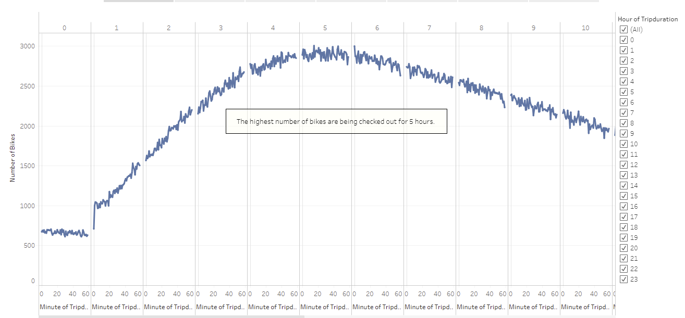
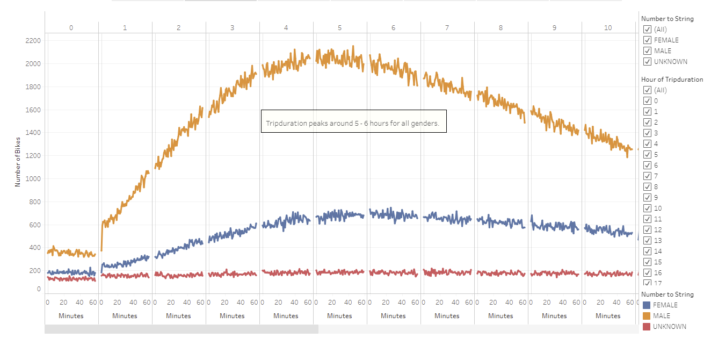
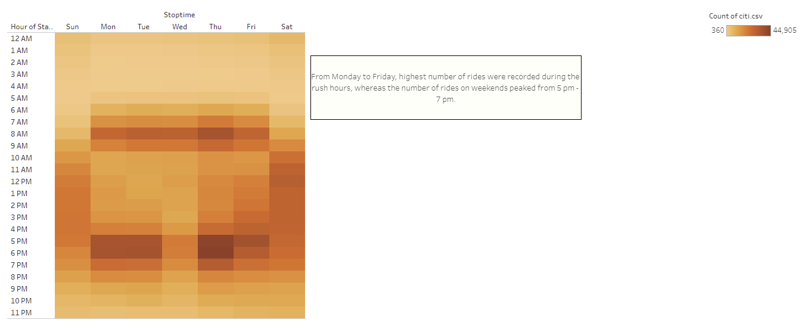
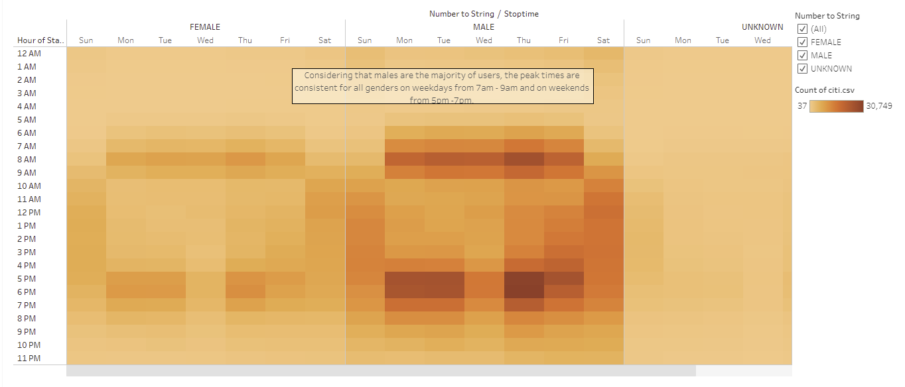
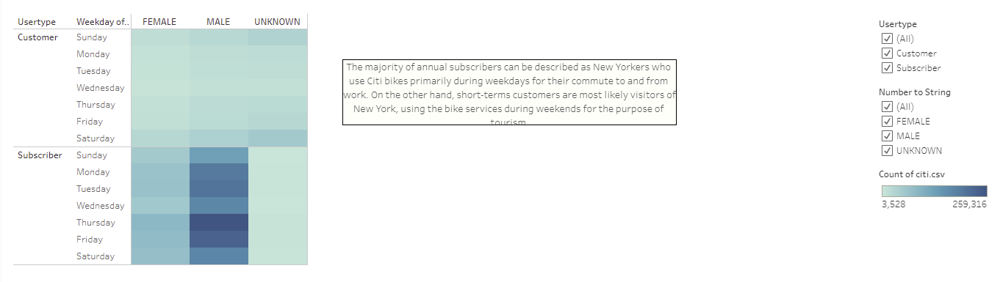
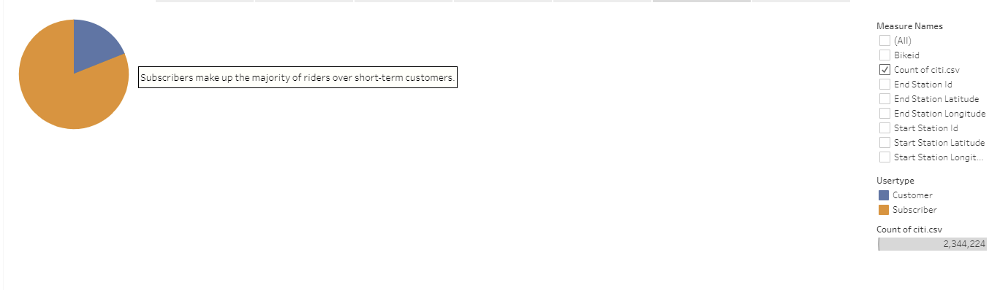
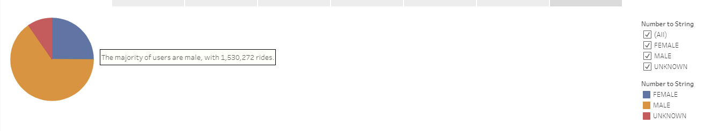

# NYC Citibike Analysis

## Overview of the Citibike Analysis
The purpose of this analysis is to create a dynamic visualization of Citibike New York data for the month of August 2019 with the use Tableu. 
## Results 

Link to Tableau Project: [link to dashboard](https://public.tableau.com/profile/fluffy2720#!/vizhome/Challenge_16036624083200/NYCCitibike?publish=yes "link to dashboard")

### 1. Checkout Time for Users: 

The line chart below shows the amount of time that bikes were in use by riders in New York. 
- The analysis shows that majority of Citibike riders use the service from 4 to 6 hours a day
- The x-axis represents the length of time the bikes were in use and the y-axis represents the number of bikes that were in use for those durations

### 2. Checkout Times by Gender: 

The line chart below shows the amount of time that bikes were in use by different genders. 
- In this graph, we showcase the use by genders with different colour lines- orange represents male, blue represents female, and red represents undisclosed gender
- The analysis shows that in Citibikes services is primarily used by males 
- The analysis also shows that both Females and Males primarily use the service from 4 to 6 hours a day 
- The x-axis represents the length of time that the bikes were in use and the y-axis represents the number of bikes that were in use for those durations 

### 3. Trips by Weekday Per Hour: 

This heat map below showcases the number of trips taken every day of the week per every hour. 
- The x-axis represents the day of the week and the y-axis represents the hour of the day
- In this map, the lightest to darkest colour blocks represent the lowest to highest usage of Citibikes respectively.
- The analysis shows that the highest bike usage is from 7 am to 9 am and 5 pm to 7 pm on weekdays. The higher numbers during those periods are most likely influenced by the commuters, who use the services as they transportation to and from work. During weekends, the usage of bikes is fairly consistent throughout the day
- The highest usage of Citibikes is recorded on Thursday at 6 pm at 44,905 riders
- The lowest usage of Citibikes was recorded from 12 am to 5 am every day. This period of time could be utilized towards repairs and maintenance of bikes

### 4. Trips by Gender (Weekday Per Hour):

This heat map below showcases the number of trips taken every day of the week per every hour by different genders
- It was established in the previous analysis that the majority of Citibike users are males 
- This map shows that males most frequently use the Citibike service during the weekdays between 8 am and 9 am, as well as between 5 pm to 7 pm, which most likely represents the male population of commuters described in the previous analysis. The highest number of male riders was recorded on Thursday at 6 pm. 
- Females most frequently use the Citibike service during the weekdays between 7 am to 9 am and then from 5 pm to 7 pm. The highest number of riders among females also remains to be on Thursday at 6 pm.

### 5. User Trips by Gender by Weekday: 

This heat map illustrates the number of User Trips by Gender by Weekday. 
- Based on the heat map, then number of subscribers is greater than short-term customers. 
- Based on the data male subscribers are using Citibikes more than females. 

### 6. Customer Type: 

This pie chart illustrates the number of subcribers and short-term customers.  
- There are 1,900,359 number of subscribers.
- There are 443,865 number of customers.
- Based on the analysis majority of riders are subscribers. 

### 7. Users by gender: 

This pie chart illustrates the number of users by gender. 
- There are 1,530,272 male users
- There are 588,431 female users 
- There are 225,521 unknow gender users 
- Based on the analysus majority of riders are male.  

## Summary of Citibike Analysis

Based on the analysis of the data: 
- The highest usage of Citibike during the month of August was recorded between 7 am to 9 am and 5 pm to 7 pm which most likely was influence by the commuters using the service 
- The highest usage during each week was recorded on Thursday night
- The lowest usage was recorded between 12 am and 5 am during the week, which indicates that these periods can be utilized towards maintenance of the service
- The analysis showed that the Citibike service is significantly more popular among males than females and other unknown genders 

For additional visualizations and further examination of the Citibike service and its utilization by the New York population, the analysis should include the information on origins and destinations of each trip, as well as the popularity of service among different age groups. This type of analysis would help to determine the best approach for marketing tactics and location.
